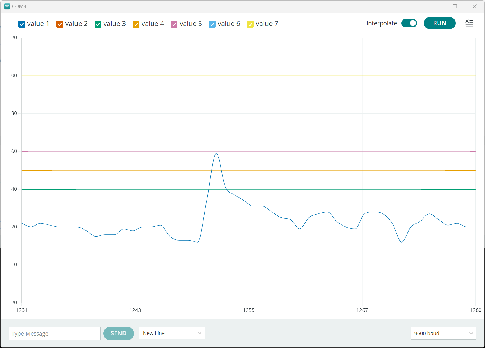

:sectnums: 
:toc: auto

= Noise Measurement

== Aim of the project

The aim of this project is to build a device to measure and report in real time the noise level of the room where it was installed.

The initial idea behind this project was to measure the noise level in an house/living room where childrens could make a lot of noise ... but it can also be used in a workplace/openspace if there is some noisy colleagues.

=== Main ideas

The device must run 24/24 and 7/7. It measure the noise level and visually report it using RGB leds. +
RGB leds color will be based on the noise level measure. For exemple, we can imagine the following configuration:

[cols="^1,^1,5"]
|===
^| **Color**    ^| **Decibel range**    ^| **Meaning**
 | GREEN         | [0,50db[              | Quiet space
 | ORANGE        | [50db, 60db[          | Normal sound level for a working place 
 | RED           | [60db, [              | Noise level too hight ... need to more calm
|===

[NOTE]
====
It could be insterresting to have values related to human health.
====

=== Project needs

* Basic needs
** low cost - too allow everyone to build it
** visualization of the noise level
* Advanced needs
** wifi connection to report noise measures
** ???  

== Solution's design

Firstly, we have to made a prototype to test if the ideas are feasible.

* can we make a correct measure with an onboard mic ?
* can we make it using only one mic ?
* ...

=== Prototypes

To make a prototype we have targeted 3 boards:

* link:https://docs.arduino.cc/hardware/nano-33-ble-sense[**Arduino Nano 33 BLE Sense**].
* link:https://docs.arduino.cc/hardware/nano-rp2040-connect[**Arduino Nano RP2040 Connect**].
* link:https://www.adafruit.com/product/3333[**CircuitPlayground Express**]

These boards are:

* maybe too costly for the final target
* embed a lot of unneeded components

but they'll allow us to make a first/basic prototype really easily. +
In addition, this choice allow us to use 2 software solutions:

* C/C++ (using Arduino or others)
* circuitPython / micropython

==== NoiseMeasurement and Serial Plotter

This first kind prototype will focus on the noise measurement part. We'll simply ouput the result using the serial plotter to show the result. +
Nothing hard to do ... all is already done in the following exemple: https://docs.arduino.cc/learn/built-in-libraries/pdm

Here is an exemple of the graph generated in real time.

See the link:src\BLE_33_Sense\noise_measurement_proto_01\noise_measurement_proto_01.ino[prototype code] for more details.

==== NoiseMeasurement and RGB led

This second kind of prototype will complete the serial output with a RGB led display system. Instead of using the onboard led that is not really clearly visible, we'll use an additionnal leds. This is the reason why we have select the CircuitPlayground Express. This board embed 10 NeoPixels leds directly on the PCB. 

See the link:src\CircuitPlayground_Express\SoundMeter_01\SoundMeter_01.ino[prototype code] for more details.

#TODO: Add code details#

==== What next ?

Now that we have made a basic prototype we can go deeper in the final project.

* must we go deeper in noise level calculation ?
* what feature did we want to add ? (Wifi)
* what design does we need ? 

